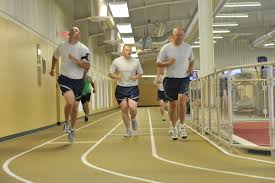

  
  
  
  
  
  
  
  
  
  
  This project meant alot to me as I was growing as a young junior Air Force troop.  
  
  I was a young fitness specialist that barely graduated out of basic training and technical school.  Technical school is the school that the Air Force ships you to (depending on what career field you chose before you joined the military) to begin your professional training.  Part of my training in technical school required me to learn how to take care of my body by lifting weights, running, cycling, and the like.  This school also trained me in how to maintain fitness equipment and how to workout your body to the point of maximum stress without injuring yourself.  This is where I found discipline, attention to detail, a sense of urgency, and my motivation to strive for excellence.  
  
  Discipline in working as a fitness center professional meant that no matter what you do here, you must maintain the highest of standards.  During my time here at the Peterson Fitness center(Colorado Springs), I temporarily worked as a fitness assessment manager.  This means I was responsible for giving fellow Air Force members their annual or semi-annual physical fitness assessments.  I had to show them what a push-up looked like, what a sit-up looked like, how far that individual needed to run, and all in all NEVER to cheat on this exam because it would only mean that you are cheating yourself.  This is where learning attention to detail came in.  Not only did I have to maintain proper posture and movement ability to show what a push-up or a sit-up looked like, I also had to explain what you can or cannot do (for example:  Don't do a push up on your knees, do it properly with your back-straight and head flush from the ground).
  
  
  
  My sense of urgency was tested multiple times here as well.  Since I was working at the fitness center as a fitness specialist, my team and I was required to be trained on how to handle emergency situations.  This meant learning how to do CPR, where the alarms were in the facility if I needed to turn them on, where the defibbrilators were around the gym (just in case of a heart situation), and other similar tasks.  During my time as a fitness assessment manager as well as a fitness center specialist, I had to experience these emergency situations first hand.  As a fitness assessment manager, the critically important task to assess fellow Air Force members meant that it came with a sense of urgency.  Sometimes, Air Force members that took the fitness assessment was not always up to the standard that the Air Force wants them to be.  These people would often overexert themselves and try to pass the fitness assessment by doing so.  This would almost always end in disaster.  There were multiple times where the member doing the assessment would fall from a run on the outside track or throw up due to overexertion.  Me as well as my team had to be ready at these times to see if that person just needed to catch his/her breath or an ambulance or even worse... CPR.
  
  
  
  
  Striving for excellence meant everything to me in and out of the Air Force.  I knew that if I didn't strive for excellence that someone might either get hurt or even die.  Imagine if I didn't try my best in assessing fitness standards to people or didn't run fast enough during an emergency as someone has collapsed on the track or did not clean or maintain fitness equipment properly.  I can say for absolute certainty that anything short of doing my best would have meant critical consenquences for me and my team.  This was simply not a negotiation as far as this was concerned.  I could not take no for an answer when it came to problem solving these difficult tasks. 
  
If you would like to know more about where I worked at in the military, here is a link
https://www.21fss.com/about/fitness-center/
