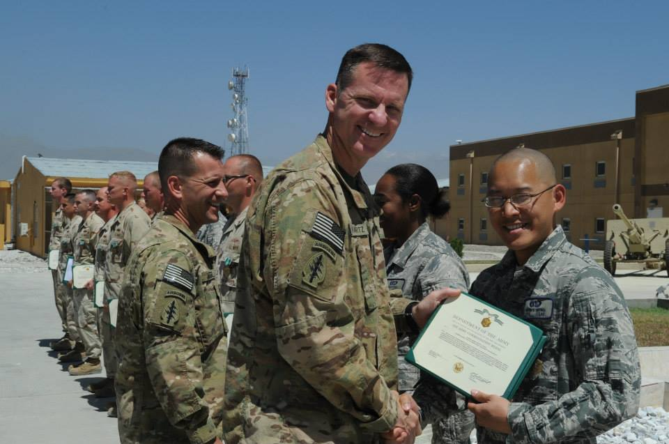
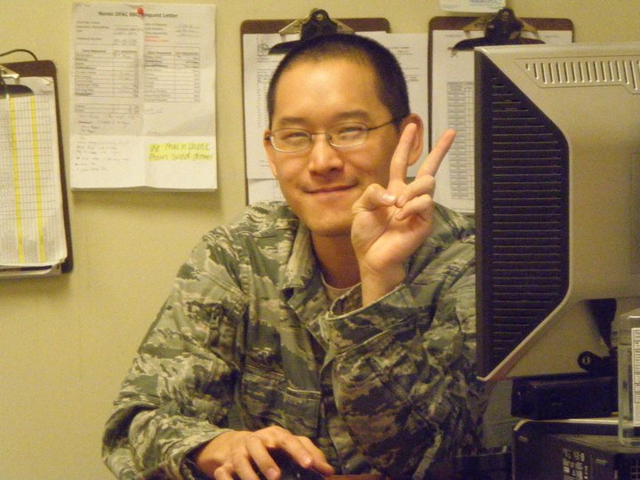

Throughout my career as an Air Force Line Cook, I have met some amazing people.  People that I had the pleasure of serving with.  These people were some of the best people I have ever met in my life and I would happily do it again. 

During the time I was a cook in the military, I have served over 10,000 people during peacetime bases and well over 50,000 people overseas.  I have created and innovated my way into completing arduous problem solving tasks with culinary professionals.  For example, during my overseas deployment, I have had the opportunity to work with nearly 40 Afghan people.  These people served as an equal in creating a menu, implementing that menu, and occasionally cooking "on the fly" when cooked food was not so readily available(also known as out of stock food).  

My team during peacetime bases and overseas deployments have exemplified the highest of professionalism and discipline that any military commander would be proud to serve over them.  We also knew how to have a little bit of fun while serving.  We put in our heart and soul into every dish that we made and sometimes, we would cook dishes that reflected us in our culture/background.  One day after breakfast service in my dining facility in Peterson Air Force Base, Colorado, I made a well-known Hawaiian local dish called "Loco Moco".  It is a dish served with a bed of rice with a big hamburger patty and a sunny side egg on top of that rice.  My co-workers were all skeptical about this dish as they shivered at the thought of eating this dish.  Turns out, they were pleasantly surprised!  I could see the look on their faces as they ate the well-cooked ground beef hamburger patty and the slightly runny egg on top of it.  I gave them quite the shock as they all enjoyed the meal that I have cooked for them.  

Here are some of the achievements my cooks and I have made throughout my culinary arts career:

· Work effort aided 21st force support squadron in winning 2008 Air Force Space Command Gen Curtis E. LeMay award as best unit in Air Force Space Command.

· Leader,  Filled a managerial position as shift supervisor for three personnel that led to $40K in receipts and 100% accountability.

