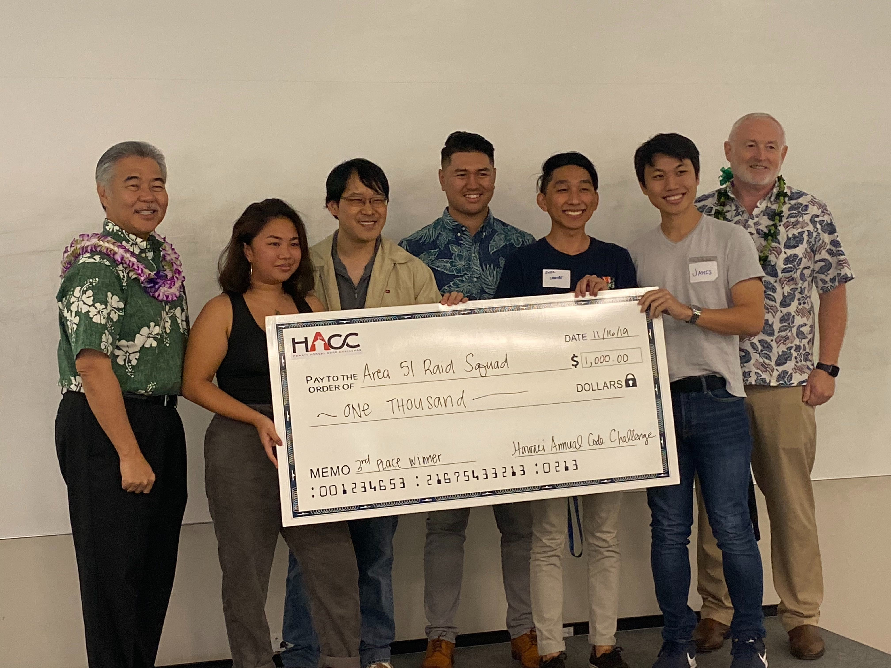

During the middle of October to November 2019, there was a month long hackathon competition for the State of Hawai'i called the HACC (Hawai'i Annual Code Challenge).  This competition encompasses many of the state's real-world problems.  Annually, the sponsors of this competition come to us on the first opening day and explain to us their elaborate problems that we as collegiate and high school students would have to solve algorithmically.  

There were five challenges that the state of Hawai'i asked of us to find the solutions for on a software development / algorithmic problem solving kind of way.

click [here](https://hacc.hawaii.gov/#challenges_anchor) for more detailed explanation about these five challenges

Out of the five problems that the State of Hawai'i proposed to my team, we chose to pick the HECO problem.  

ENERGY/HECO ELECTRIC VEHICLE CHARGING ANALYSIS
State Energy Office/Hawaii Electric Co. Electric Vehicle Charging Analysis

Challenge Description: a dashboard displaying health of charging station shall be updated every 5-10 minutes using key metrics developed from charging data analysis. A utilization tracker shall include a “congestion” threshold at which a new station in the same location is needed. The impact from EV charging would better inform stakeholders the amount of power used during various times of day by EVs and the corresponding reductions in fossil fuel use and in GHG emissions.

The first approach to this challenge was to set up specific times of the week for all of us to get together and work on the project specifically.  Here is the steps that we took in order to solve this problem (in no particular order):

Step 1:  Establish a working environment and schedule.  Working with a team is EXTREMELY important in kicking off this project the right way.  We had a six man team.  Each of us was a software developer and so what we did was to use half of us for front-end design and half of us for back-end design.  

Step 2:  Gathering and researching data (data analysis).  What is it that we must know to tackle the problem?  We had to ask questions in order to figure out the right way in approaching this problem.  Having a stable and healthy communication between the sponsor (client) and us (the developers) was very important in making a working application that compliments the client's data. 

Step 3: Finding the right tools to go with the development cycle.  In all honesty, we could have done better.  We kind of chose what would work best with out application instead of thinking of what the clients would use.  We should have communicated a bit better for that.  

Step 4:  Throughout the developmental cycle, we used the data that was given to us as well as the data analysis from our research to develop a working web app that is user-friendly towards our clients and their company. 

After we have took these steps in solving this problem, we took refined steps on how to explain this project through a video and by answering questions from various clients, representatives, and judges.  

After a month of rigorous coding, problem solving, and research, we managed to push out a project that catered well with HECO (Hawaiian Electric Company).  During the day of judging, each team had to explain what their projects do with respect to their challenge descriptions.  We were given three minutes to explain our projects and two minutes for questions and answers.  There were at least 20 teams explaining their own projects so five minutes per team seemed reasonable.  Otherwise, we would all be there until midnight waiting for everyone to finish up their explanation on their projects.  

To close, this was an enlightening experience.  This was the first time I attended a hackathon competition.  This was also the first time I could use my computer science skills from my classes in a real world environment.  I must say, out of all the things I have done professionally, this reinvigorated my passion to become a well established software developer in the future.

## Here is the hyperlink to the HACC websites
[Hawaii Annual Code Challenge Official Website](https://hacc.hawaii.gov/)

[Hawaii Annual Code Challenge Devpost Website](https://hacc2019.devpost.com/)

## Here is the hyperlink to my team's final project.
[Volts Wagon](https://devpost.com/software/volts-wagon)
 
