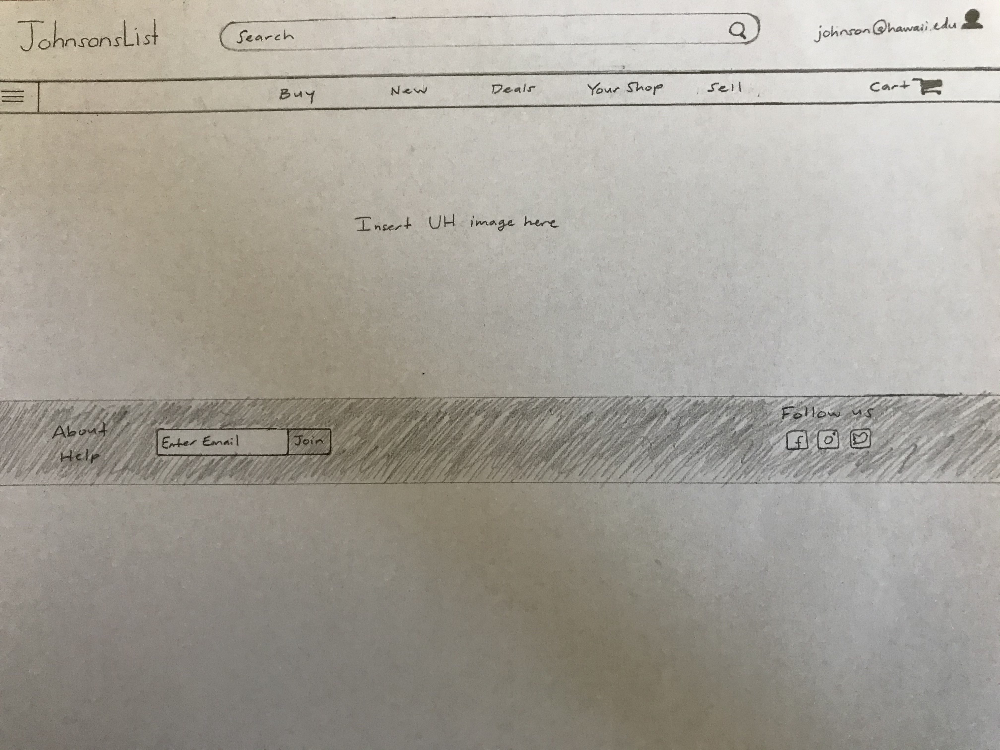
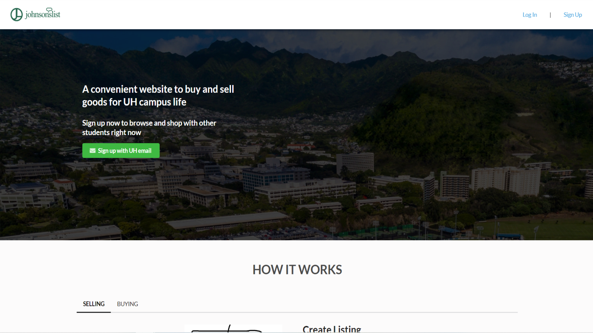

This project involved three student developers.  As a team, we were responsible for creating our own website application from a meteor template created in ReactJS, HTML, CSS, and Semantic-UI.  We were given a meteor template that already had log-in code and some custom navbar and footer templates written in ReactJS.  In order to create an attractive sales website, we had to start from scratch and ask ourselves, "what would the user want to do with this website?", "what kinds of things could we add into this website that would make the user keep coming to visit this website?",  "how user-friendly can we make this website?".  

With these questions in mind, we created templates from scratch by drawing each page as detailed as we could.  In order to create a well-working sales website, we found inspiration from other various attractive sales websites and emulated their styles of functionality.  Throughout the creation of this project, we completed each question by problem-solving our way through step-by-step coding concepts.  We also had to work together often to ask each other questions to understand the problem that we are having as well as to solve the problem correctly.  Misunderstandings can most likely create more problems than fix the original problem itself.  That is why it is best to ask alot of questions, even if you have the slightest misunderstanding.  

After we have created templates for these pages, it was time for us to create them in real-time through creative coding sessions.  Since there were three of us, we each had different things to do evenly.  For example, I was responsible for creating the navigation bar.  My other two classmates was responsible for creating the navigation bar and the background.  Once we finished doing this, we combined all three of these properties to create the main template for our website's landing page.  

Here are the links to my project and the descriptions to these projects:

[JohnsonsList Live website](http://johnsonslist.meteorapp.com/#/)

[JohnsonsList github.io](https://johnsonslist.github.io/)
